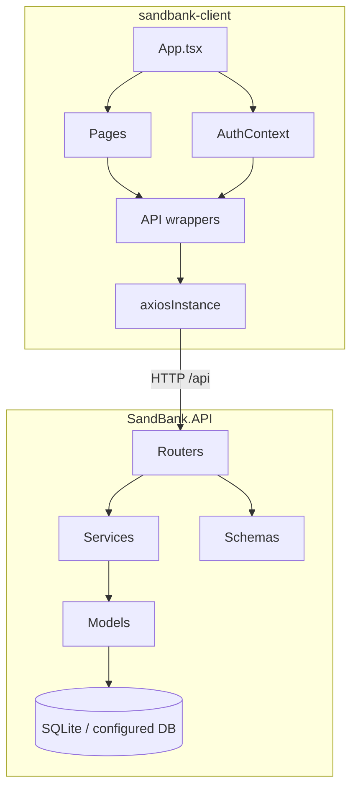

# SandBank - Contents Diagram

This document is the repository map for the current codebase. For behavior details, use the companion docs in this folder:

- `api-dictionary.md` for endpoint contracts
- `navigation-diagram.md` for routes and user flow
- `presentation-diagram.md` for the frontend view layer
- `installation-manual.md` for setup
- `users-manual.md` for operator and end-user workflows

## Project Structure Overview

```
SandBank-dev/
├── README.md
├── LICENSE
├── docs/
│   ├── api-dictionary.md
│   ├── contents-diagram.md
│   ├── installation-manual.md
│   ├── navigation-diagram.md
│   ├── presentation-diagram.md
│   └── users-manual.md
│
├── sandbank-client/               # Frontend (React + TypeScript + Vite)
│   ├── index.html
│   ├── package.json
│   ├── vite.config.ts
│   ├── tsconfig.json
│   ├── tsconfig.app.json
│   ├── tsconfig.node.json
│   ├── eslint.config.js
│   ├── public/
│   └── src/
│       ├── main.tsx              # React bootstrap
│       ├── App.tsx               # Router and top-level navigation
│       ├── App.css               # Feature/page styling
│       ├── index.css             # Global tokens and base styles
│       ├── api/                  # Axios instance + endpoint wrappers
│       ├── assets/               # Static images and logo
│       ├── components/
│       │   └── ProtectedRoute.tsx
│       ├── context/
│       │   └── AuthContext.tsx   # Auth state persisted in localStorage
│       ├── hooks/                # Convenience hooks (not used everywhere)
│       └── pages/
│           ├── Home.tsx
│           ├── Activities/
│           ├── Admin/
│           ├── Auth/
│           ├── Credits/
│           ├── Requests/
│           └── Transactions/
│
└── SandBank.API/                  # Backend (FastAPI + SQLAlchemy)
    ├── main.py                   # FastAPI app, CORS, router registration
    ├── config.py                 # Settings loaded from .env
    ├── database.py               # Engine, session, Base, dependency
    ├── create_admin.py           # One-off bootstrap script
    ├── requirements.txt
    ├── models/                   # SQLAlchemy persistence models
    ├── routers/                  # HTTP endpoints grouped by domain
    ├── schemas/                  # Pydantic request/response schemas
    └── services/                 # Business rules and DB orchestration
```

## Execution Entry Points

| Surface                 | File                           | Purpose                                       |
| ----------------------- | ------------------------------ | --------------------------------------------- |
| Frontend app start      | `sandbank-client/src/main.tsx` | Mounts the React application                  |
| Frontend routing        | `sandbank-client/src/App.tsx`  | Defines routes and header navigation          |
| Backend app start       | `SandBank.API/main.py`         | Creates the FastAPI app and registers routers |
| Backend admin bootstrap | `SandBank.API/create_admin.py` | Seeds a default admin account                 |

## Architecture Diagram



## Module Responsibilities

| Layer            | Location                                            | Responsibility                                                           |
| ---------------- | --------------------------------------------------- | ------------------------------------------------------------------------ |
| API client       | `sandbank-client/src/api/`                          | Encapsulates HTTP calls to backend routes                                |
| Auth context     | `sandbank-client/src/context/`                      | Stores token and user details in memory and localStorage                 |
| Pages            | `sandbank-client/src/pages/`                        | Own most user-facing UI and directly trigger data operations             |
| Shared component | `sandbank-client/src/components/ProtectedRoute.tsx` | Guard component exists, but is not currently wired into `App.tsx`        |
| Routers          | `SandBank.API/routers/`                             | Define public and protected REST endpoints                               |
| Services         | `SandBank.API/services/`                            | Enforce permissions, state changes, and side effects                     |
| Models           | `SandBank.API/models/`                              | Persist users, activities, requests, transactions, payments, and ratings |
| Schemas          | `SandBank.API/schemas/`                             | Define request validation and response serialization                     |

## Domain Mapping

| Domain       | Frontend API                                | Backend router    | Service                               | Primary persisted model               |
| ------------ | ------------------------------------------- | ----------------- | ------------------------------------- | ------------------------------------- |
| Auth         | `authApi.ts`                                | `auth.py`         | `auth_service.py`, `token_service.py` | `user.py`                             |
| Users        | client uses auth context + direct endpoints | `users.py`        | `user_service.py`                     | `user.py`                             |
| Activities   | `activitiesApi.ts`                          | `activities.py`   | `activity_service.py`                 | `activity.py`                         |
| Requests     | `requestsApi.ts`                            | `requests.py`     | `request_service.py`                  | `service_request.py`                  |
| Transactions | `transactionsApi.ts`                        | `transactions.py` | `transaction_service.py`              | `transaction.py`                      |
| Payments     | `paymentsApi.ts`                            | `payments.py`     | `payment_service.py`                  | `payment.py`                          |
| Ratings      | `ratingsApi.ts`                             | `ratings.py`      | `rating_service.py`                   | `rating.py`                           |
| Admin        | `adminApi.ts`                               | `admin.py`        | `admin_service.py`                    | mixed admin views over several models |

## Tech Stack

| Layer              | Technology           | Version (approx)                 | Role                                |
| ------------------ | -------------------- | -------------------------------- | ----------------------------------- |
| Backend framework  | FastAPI              | latest                           | REST API and auto-docs              |
| ORM                | SQLAlchemy           | latest                           | Database models and queries         |
| Migrations         | Alembic              | listed but not actively used yet | Schema versioning                   |
| Auth tokens        | python-jose (HS256)  | latest                           | JWT creation and validation         |
| Password hashing   | passlib + bcrypt     | latest                           | Secure credential storage           |
| Payments           | Stripe SDK           | latest                           | Checkout sessions and webhooks      |
| Database (default) | SQLite               | bundled                          | Zero-config local persistence       |
| Frontend framework | React                | 19.x                             | Component UI                        |
| Build tool         | Vite                 | 8.x                              | Dev server and production bundler   |
| Language           | TypeScript           | 5.9                              | Type-safe frontend code             |
| HTTP client        | Axios                | 1.x                              | API communication                   |
| Data fetching      | TanStack React Query | 5.x                              | Caching (available, partially used) |
| Routing            | React Router         | 7.x                              | Client-side navigation              |

## Current Implementation Notes

- The frontend defines a `ProtectedRoute` component, but current route protection is enforced mostly by page redirects and backend authorization instead of a central route guard.
- The backend creates tables automatically through `Base.metadata.create_all(...)` on startup.
- The default database is SQLite, but the connection string is configurable through `.env`.
- Credit movement for service exchanges happens when a request is accepted, while completion only changes request status.
- New users start with a default balance of **20 credits**.
