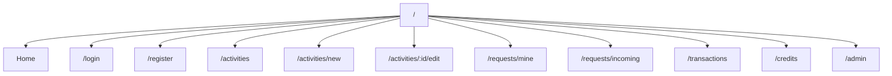
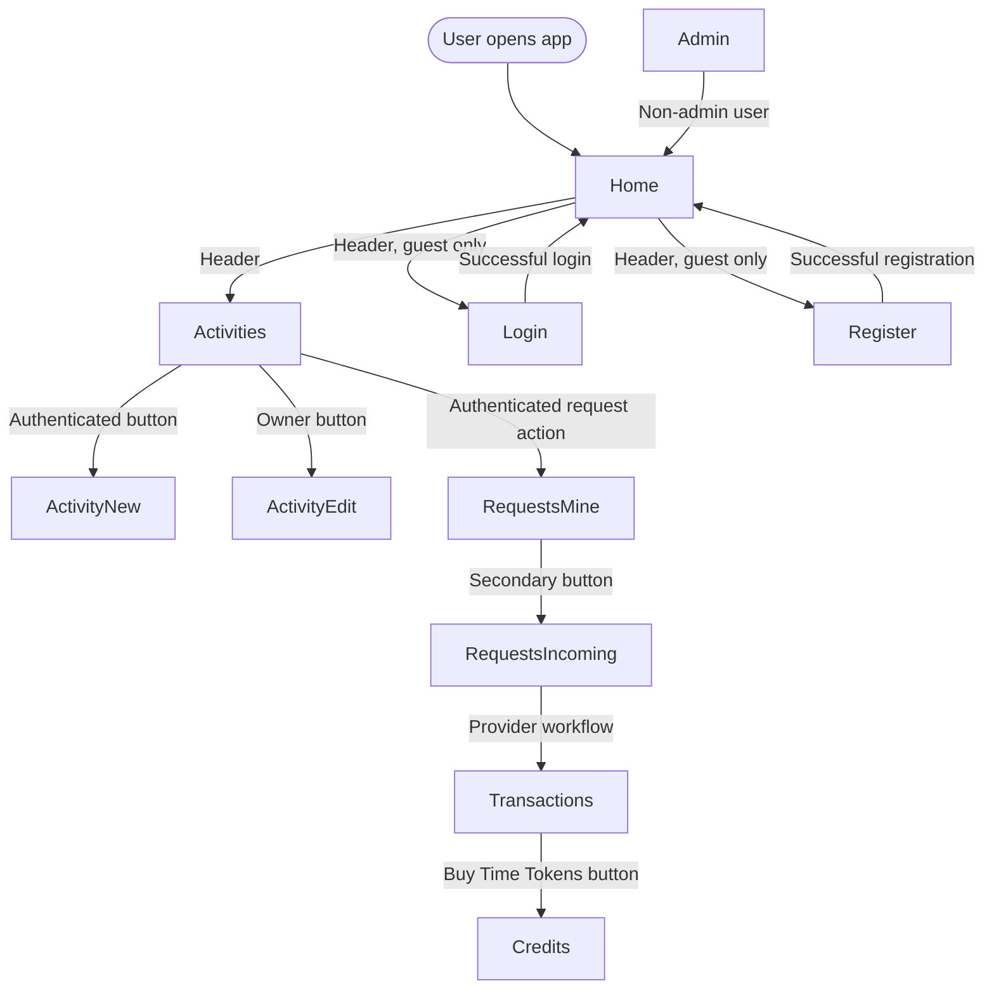
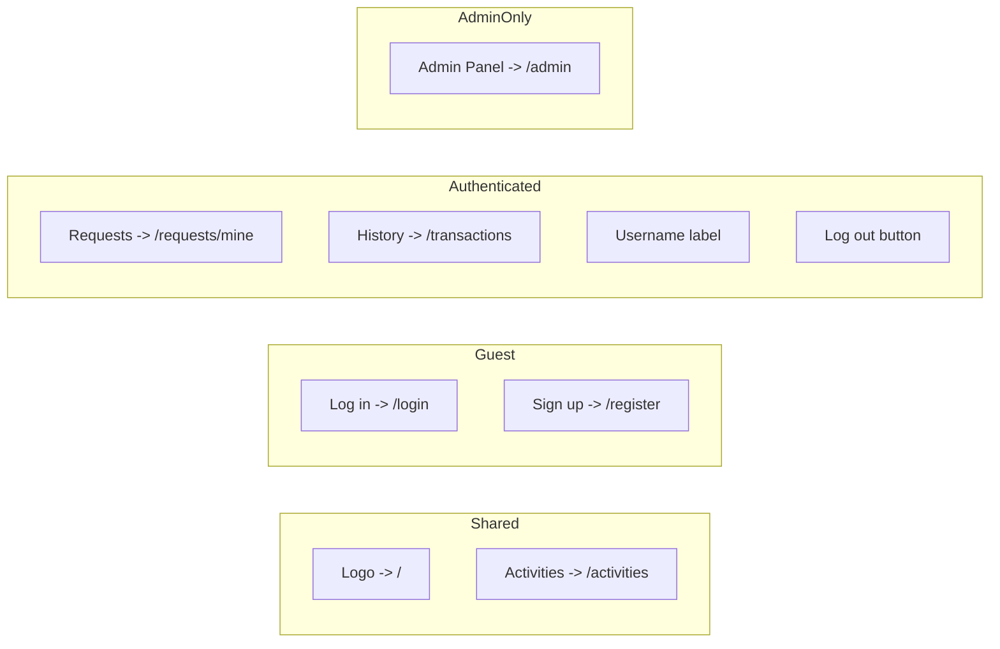
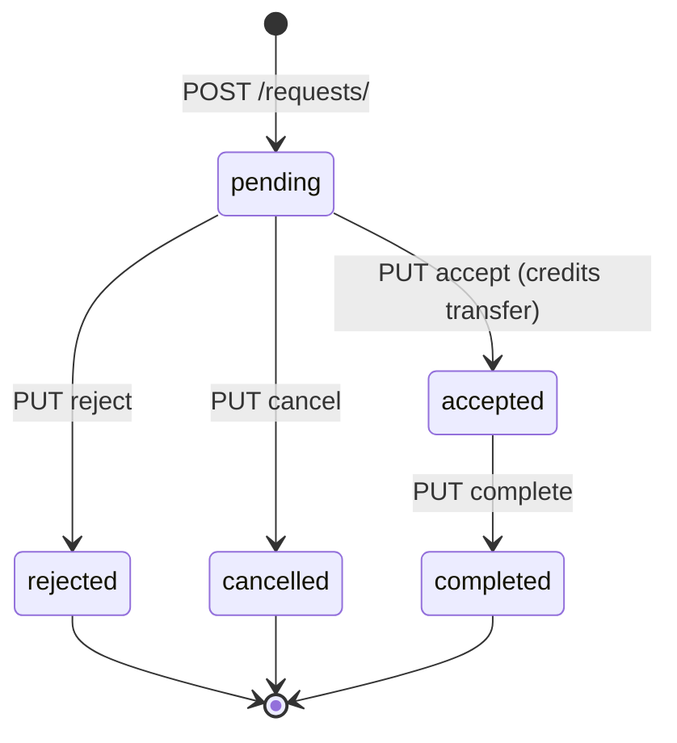

# SandBank - Navigation Diagram

This document reflects the current frontend router and the effective access behavior of the running app. It distinguishes between routes that are registered in `App.tsx` and routes that are actually protected by redirect logic or backend authorization.

## Route Map



## Route Registry

| Path                   | Component            | Registered in router | Effective behavior                                  |
| ---------------------- | -------------------- | -------------------- | --------------------------------------------------- |
| `/`                    | `Home`               | Yes                  | Public landing page                                 |
| `/login`               | `Login`              | Yes                  | Guest entry page                                    |
| `/register`            | `Register`           | Yes                  | Guest entry page                                    |
| `/activities`          | `ActivitiesList`     | Yes                  | Public list; write actions require login            |
| `/activities/new`      | `ActivityForm`       | Yes                  | Form renders, but create API requires login         |
| `/activities/:id/edit` | `ActivityForm`       | Yes                  | Form renders, but update API requires owner auth    |
| `/requests/mine`       | `MyRequests`         | Yes                  | Reads protected APIs; usable only when logged in    |
| `/requests/incoming`   | `IncomingRequests`   | Yes                  | Reads protected APIs; usable only when logged in    |
| `/transactions`        | `TransactionHistory` | Yes                  | Reads protected APIs and balance endpoint           |
| `/credits`             | `BuyCredits`         | Yes                  | Checkout creation requires login                    |
| `/admin`               | `AdminPanel`         | Yes                  | Client redirects non-admin users to `/` after mount |

## Navigation Flow



## Header Navigation Bar



## Access and Enforcement Notes

| Route group                     | Enforcement in current app                                                            |
| ------------------------------- | ------------------------------------------------------------------------------------- |
| Public routes                   | Directly available with no auth requirement                                           |
| Activity create/edit            | No centralized route guard; backend permissions enforce the write operation           |
| Requests, transactions, credits | Pages are routable, but their data calls require a valid token                        |
| Admin                           | No `ProtectedRoute` wrapper in router; `AdminPanel` redirects non-admin users on load |

## Primary User Journeys

### Registration and first login

```text
/ -> /register -> account created -> authenticated session -> /
```

### Offering a service

```text
/activities -> + New Activity -> submit form -> /activities
```

### Requesting a service

```text
/activities -> Request -> /requests/mine
```

### Provider handling a request

```text
/requests/incoming -> Accept -> credits transfer immediately -> Mark Complete -> status becomes completed
```

### Buying credits

```text
/transactions -> Buy Time Tokens -> /credits -> Stripe checkout -> /credits?status=success
```

## Service Request Lifecycle



| Transition               | Who can trigger       | Side effects                                                                   |
| ------------------------ | --------------------- | ------------------------------------------------------------------------------ |
| `pending` → `accepted`   | Activity owner        | Credits deducted from requester, added to provider; transaction record created |
| `pending` → `rejected`   | Activity owner        | None                                                                           |
| `pending` → `cancelled`  | Requester             | None                                                                           |
| `accepted` → `completed` | Requester or provider | Status change only; no further credit movement                                 |
