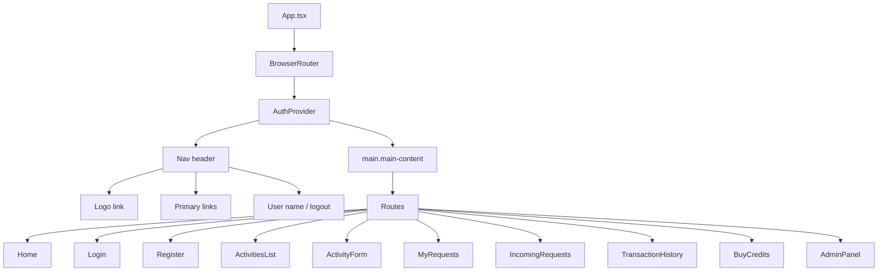
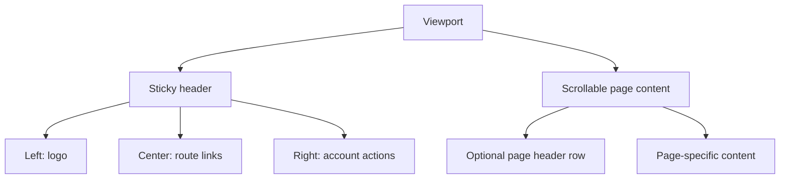
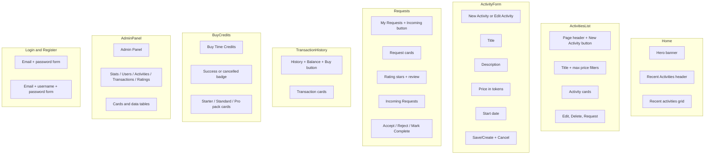
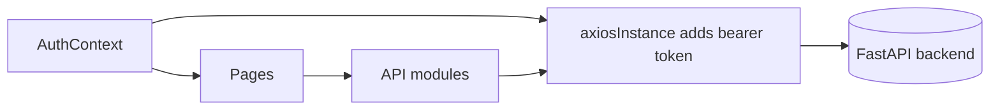

# SandBank - Presentation Diagram

This document describes the implemented presentation layer as it exists now, not an aspirational design system.

## UI Component Hierarchy



## Layout Skeleton



## Page Composition



## Presentation Responsibilities

| Layer           | What it currently owns                                             |
| --------------- | ------------------------------------------------------------------ |
| `App.tsx`       | Header, routes, and top-level composition                          |
| Page components | Most fetching, mutation handling, empty states, and action buttons |
| `AuthContext`   | Session persistence and auth state                                 |
| API wrappers    | HTTP request boundaries                                            |
| CSS files       | Tokens, layout, cards, forms, badges, and admin tables             |

## Data Flow in the Frontend



## Visual Patterns

### Activity card

```text
+--------------------------------+
| Title                          |
| Description                    |
| Price: N                       |
| [Edit] [Delete] or [Request]   |
+--------------------------------+
```

### Request / transaction card

```text
+--------------------------------+
| Primary line                   |
| Supporting text                |
| Date / status badge            |
| Action button(s) if available  |
+--------------------------------+
```

### Form card

```text
+--------------------------------+
| Form title                     |
| Label                          |
| [Input / textarea]             |
| Label                          |
| [Input / textarea]             |
| [Primary] [Secondary]          |
+--------------------------------+
```

## Responsive Behavior

| Area                          | Current behavior                                                 |
| ----------------------------- | ---------------------------------------------------------------- |
| Root container                | Constrained to 1100px with fluid shrink on smaller screens       |
| Activities grid               | Uses auto-fill grid and collapses naturally as width shrinks     |
| Filters                       | Wrap onto multiple lines                                         |
| Header links                  | Remain in a horizontal nav; there is no hamburger menu component |
| Request and transaction lists | Stack vertically                                                 |

## Design Tokens

The application defines its visual language through CSS custom properties in `index.css`:

| Token            | Value               | Usage                       |
| ---------------- | ------------------- | --------------------------- |
| `--text`         | `#4b5563`           | Body text                   |
| `--text-h`       | `#111827`           | Headings and emphasis       |
| `--text-muted`   | `#9ca3af`           | Secondary text              |
| `--bg`           | `#fafafa`           | Page background             |
| `--bg-card`      | `#ffffff`           | Card surfaces               |
| `--border`       | `#d0d0d0`           | Borders and dividers        |
| `--accent`       | `#ffcc86`           | Primary buttons and links   |
| `--accent-hover` | `#ffeba8`           | Button hover state          |
| `--success`      | `#10b981`           | Positive actions and badges |
| `--danger`       | `#ef4444`           | Destructive actions         |
| `--warning`      | `#f59e0b`           | Pending states              |
| `--radius`       | `8px`               | Default border radius       |
| `--radius-lg`    | `12px`              | Card border radius          |
| `--sans`         | Inter, system-ui, … | Primary typeface            |

## CSS Architecture

| File        | Scope                                                          |
| ----------- | -------------------------------------------------------------- |
| `index.css` | CSS reset, tokens, global element styles, utility classes      |
| `App.css`   | Header, page layouts, cards, forms, admin tables, credits grid |

There is no CSS-in-JS, CSS modules, or utility-class framework. All styling is plain CSS using the custom properties above.

## Implementation Notes

- The frontend mixes direct page-level data fetching with a small set of custom hooks; hooks are not the only data access pattern.
- There is no dedicated profile page in the current route set.
- The credits screen is a pack selector that redirects to Stripe, not a form-heavy checkout page rendered inside the app.
- The root container is constrained to `1100px` max-width for readability on wide displays.
